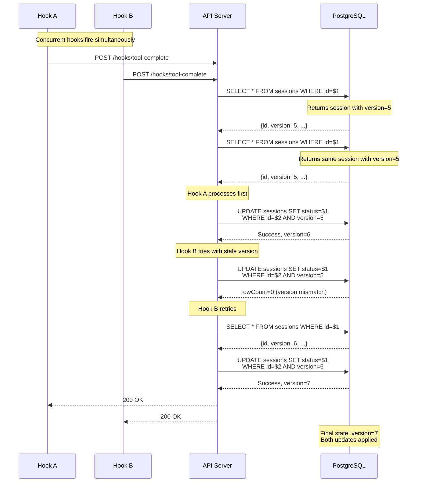

# Session Concurrency Control

This document describes the optimistic locking implementation used to prevent race conditions when multiple concurrent processes update the same session.

## Problem

When Claude Code hooks fire concurrently (e.g., multiple tool completions in rapid succession), they may read and update the same session simultaneously. Without proper concurrency control, this can lead to:

1. **Lost updates**: One process overwrites changes made by another
2. **Stale data**: Processes make decisions based on outdated session state
3. **Inconsistent state**: The session ends up in an invalid state

## Solution: Optimistic Locking

We implement optimistic locking using a `version` column in the sessions table. This approach:

- Works seamlessly with connection pooling
- Avoids deadlock risks
- Provides better performance than row locks
- Allows explicit retry logic with exponential backoff

### How It Works

1. Each session has a `version` integer column (starts at 1)
2. Before updating, read the current session (including version)
3. Update with a `WHERE id = $1 AND version = $2` clause
4. If `rowCount = 0`, another process modified the session - retry
5. The database trigger auto-increments version on every update



## Database Schema

### Version Column

```sql
ALTER TABLE sessions
ADD COLUMN version INTEGER NOT NULL DEFAULT 1;

CREATE INDEX idx_sessions_id_version ON sessions (id, version);
```

### Auto-Increment Trigger

```sql
CREATE OR REPLACE FUNCTION update_session_version()
RETURNS TRIGGER AS $$
BEGIN
    NEW.version := OLD.version + 1;
    NEW.updated_at := NOW();
    RETURN NEW;
END;
$$ LANGUAGE plpgsql;

CREATE TRIGGER trigger_update_session_version
BEFORE UPDATE ON sessions
FOR EACH ROW
EXECUTE FUNCTION update_session_version();
```

## API Usage

### Reading Sessions

All session queries now return the `version` field:

```typescript
const session = await getSessionById(db, sessionId);
// session = { id, status, version: 5, ... }
```

### Updating with Version Check

Use `updateSessionWithVersion` for updates that require consistency:

```typescript
import { updateSessionWithVersion, VersionConflictError } from '../db/queries';

try {
  const newVersion = await updateSessionWithVersion(
    db,
    sessionId,
    { status: 'completed' },
    expectedVersion  // The version you read earlier
  );
  console.log('Updated to version:', newVersion);
} catch (error) {
  if (error instanceof VersionConflictError) {
    console.log('Session was modified by another process');
    // Refetch and retry
  }
  throw error;
}
```

### Using the Retry Utility

For operations that should automatically retry on conflicts:

```typescript
import { updateSessionWithRetry } from '../db/retry';

const result = await updateSessionWithRetry(
  db,
  sessionId,
  { status: 'active' },
  { maxRetries: 3, baseDelayMs: 100 }
);

if (result.success) {
  console.log('Updated to version:', result.value);
} else if (result.retriesExhausted) {
  console.log('Failed after', result.attempts, 'attempts');
}
```

### PATCH Endpoint with Version

The `PATCH /api/sessions/:id` endpoint now supports optional version checking:

```bash
# Without version (legacy, backward compatible)
curl -X PATCH http://localhost:3001/api/sessions/123 \
  -H 'Content-Type: application/json' \
  -d '{"status": "completed"}'

# With version (optimistic locking)
curl -X PATCH http://localhost:3001/api/sessions/123 \
  -H 'Content-Type: application/json' \
  -d '{"status": "completed", "version": 5}'
```

Response with version:
```json
{
  "status": "updated",
  "version": 6
}
```

Version conflict response (HTTP 409):
```json
{
  "error": "Version conflict - session was modified by another process",
  "code": "VERSION_CONFLICT",
  "expectedVersion": 5,
  "actualVersion": 7,
  "hint": "Refetch the session and retry with the current version"
}
```

## Retry Strategy

### Configuration Options

```typescript
interface RetryOptions {
  maxRetries?: number;      // Default: 3
  baseDelayMs?: number;     // Default: 100
  maxDelayMs?: number;      // Default: 1000
  jitterFactor?: number;    // Default: 0.1
}
```

### Exponential Backoff with Jitter

Delays follow the formula:
```
delay = min(baseDelay * 2^attempt, maxDelay) + random_jitter
```

Example with defaults:
- Attempt 1: ~100ms
- Attempt 2: ~200ms
- Attempt 3: ~400ms

Jitter prevents thundering herd problems where many processes retry simultaneously.

## Monitoring

### Metrics Endpoint

The hooks API exposes retry metrics at `GET /api/hooks/metrics`:

```json
{
  "retryMetrics": {
    "totalAttempts": 1234,
    "successfulFirstAttempts": 1000,
    "successfulRetries": 200,
    "failedAfterRetries": 5,
    "nonRetryableErrors": 29,
    "successRate": "97.24%",
    "retryRate": "16.59%"
  },
  "timestamp": "2025-01-15T12:00:00Z"
}
```

### Key Metrics

| Metric | Description | Alert Threshold |
|--------|-------------|-----------------|
| `successfulFirstAttempts` | Updates that succeeded immediately | - |
| `successfulRetries` | Updates that succeeded after retry | - |
| `failedAfterRetries` | Updates that failed after exhausting retries | > 0 |
| `retryRate` | Percentage of operations requiring retry | > 20% |

### Logging

Version conflicts are logged with detailed context:

```json
{
  "level": "info",
  "category": "retry",
  "message": "Retrying after version conflict",
  "sessionId": "abc-123",
  "expectedVersion": 5,
  "attempt": 2,
  "maxRetries": 3,
  "delayMs": 203
}
```

## Migration

### Running the Migration

```bash
psql -d claude_orchestrator -f src/db/migrations/003_add_session_version_column.sql
```

### Rollback

To rollback (removes optimistic locking):

```sql
DROP TRIGGER IF EXISTS trigger_update_session_version ON sessions;
DROP FUNCTION IF EXISTS update_session_version();
DROP INDEX IF EXISTS idx_sessions_id_version;
ALTER TABLE sessions DROP COLUMN IF EXISTS version;
```

## Best Practices

1. **Always read before update**: Fetch the current session to get the version
2. **Handle conflicts gracefully**: Don't fail the entire request on conflict
3. **Use appropriate retry counts**: 3 retries is usually sufficient
4. **Monitor retry rates**: High retry rates indicate contention issues
5. **Consider fire-and-forget**: Hook handlers should acknowledge even if retry fails

## Troubleshooting

### High Retry Rates

If retry rates exceed 20%, consider:
- Reducing parallel hook deliveries
- Batching updates where possible
- Increasing retry delays to spread load

### Persistent Conflicts

If updates consistently fail after retries:
- Check for long-running transactions holding locks
- Verify trigger is working (`SELECT version FROM sessions WHERE id = ...`)
- Monitor connection pool exhaustion

### Version Column Missing

If queries fail with "column version does not exist":
```bash
# Run the migration
psql -d claude_orchestrator -f src/db/migrations/003_add_session_version_column.sql
```
